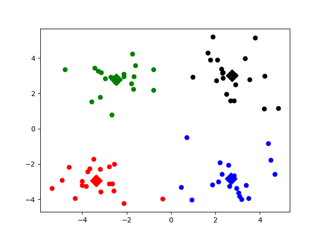

# K-Means聚类的简单应用
## 薛凤鸣
### 这玩意是干啥的？
* K-Means即以空间中k个点为形心进行聚类，对最靠近他们的对象归类。通过迭代的方法，逐次更新各簇的形心的值，直至得到最好的聚类结果。
### 这玩意咋用啊？
* 第一步：打开Python3
* 第二步：运行KMeans_cluster.py
* 第三步：read一下你要读取的数据（如demo中的text.txt），并将想分类的k值输入进去
* 第四步：回车

### 之后你大概就会见到这个东西（以k=4为例）

### 一些可能的疑惑：
#### ——“我也定义了k=4，但运行结果和你的示意图不太一样啊？”
####  因为此demo中形心的选取是随机的，也就是说每次得到的结果虽然大同小异，但其也是随机的，不能保证迭代之后必然会得到最优解
#### ——“为什么我输入k值后聚类失败了？”
#### 这只是一个小demo啦，因此我把k的上限设为了10（~~不是因为我不知道其他的颜色和形状~~）
### 欢迎指教交流！
### QQ:1349976364